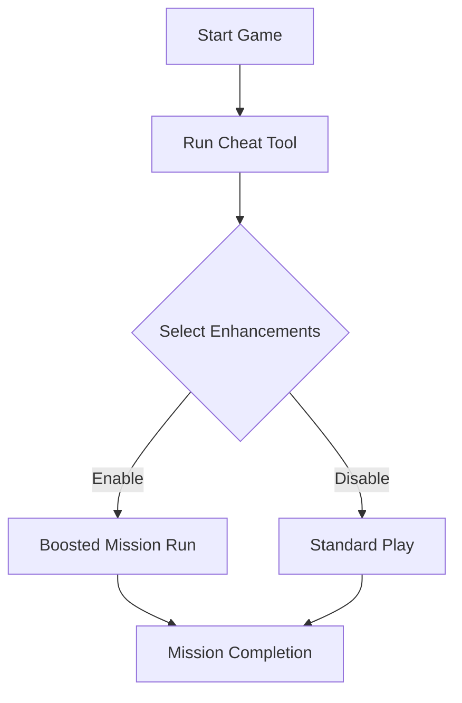

# Sniper Elite 5 Cheat 🎯

The **Sniper Elite 5 Cheat Tool** is crafted for sharpshooters who want more control over missions, stealth tactics, and survival efficiency. It unlocks customizable adjustments that help you track enemies, enhance accuracy, and manage resources—perfect for refining your experience without taking away the thrill of the hunt.

Whether your focus is **long-range headshots**, **ghost-style stealth**, or **farming mission rewards faster**, this tool ensures you stay one step ahead on the battlefield.

---

## 🔍 Overview

Sniper Elite 5 offers a highly tactical experience, but sometimes the grind of ammo management, repeated mission retries, or unpredictable AI can be frustrating. This cheat tool minimizes those barriers by providing toggles for health, ammo, and vision overlays—letting you fine-tune your playstyle.

[!WARNING]
Use this tool **only in single-player or offline campaigns**. Online use may risk bans and disrupt fair play.

---

## 🛠 Features

* **Infinite Ammo** – Never worry about bullets running out mid-mission.
* **No Recoil / No Sway** – Maintain laser-straight precision for every shot.
* **ESP Overlay (Wall Vision 👁)** – Track enemy positions through obstacles.
* **Silent Movement** – Suppress detection radius for stealth-heavy runs.
* **Instant Focus Meter** – Keep slow-motion aim ready at all times.
* **Loot Radar** – Highlights ammo caches, weapons, and intel pickups.
* **Custom Keybinds** – Assign cheats to F-keys for quick toggling.

---

## 💻 Compatibility

| Platform       | Status         | Notes                             |
| -------------- | -------------- | --------------------------------- |
| Windows 10/11  | ✅ Full Support | Optimized for Steam version       |
| Steam Deck     | ⚠️ Partial     | Requires Proton + config tweaks   |
| Linux (Proton) | ⚠️ Partial     | Basic overlay, some features vary |
| Consoles       | ❌ Unsupported  | PC-only functionality             |

[!NOTE]
Trainer works best when launched **after the game is running**.

---

## ⚡ Setup Instructions

1. **Download & extract** the Sniper Elite 5 Cheat package.
2. Run *SniperElite5.exe* first.
3. Launch `SE5_CheatTool.exe` with Admin rights.
4. Open the in-game overlay with the `Insert` key.
5. Toggle features on/off with F1–F12 or your custom keys.

```ini
[Cheats]
InfiniteAmmo=F1
NoRecoil=F2
ESP=F3
SilentSteps=F4
```

---

## 📊 Workflow Diagram



---

## ❓ FAQ

**Q: Is this cheat tool safe?**
A: Yes, for offline/single-player use. Online play is not recommended.

**Q: Can I adjust hotkeys?**
A: Yes, all bindings can be customized via the `config.ini`.

**Q: Will updates break compatibility?**
A: The cheat tool is updated frequently with Sniper Elite 5 patches.

**Q: Does it work with DLC missions?**
A: Fully supported across all story expansions.

**Q: Can I combine multiple toggles at once?**
A: Absolutely. ESP + Infinite Ammo + Silent Movement is a common combo.

---

## 🎯 Final Thoughts

The **Sniper Elite 5 Cheat Tool** gives players the power to craft their own tactical edge, whether it’s about **precision sniping**, **stealth immersion**, or **resource control**. It’s built for hunters who want smooth, efficient gameplay while still enjoying the intensity of the battlefield.

---
